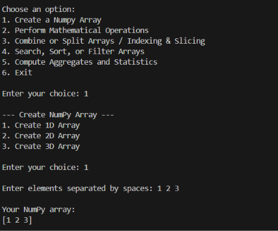
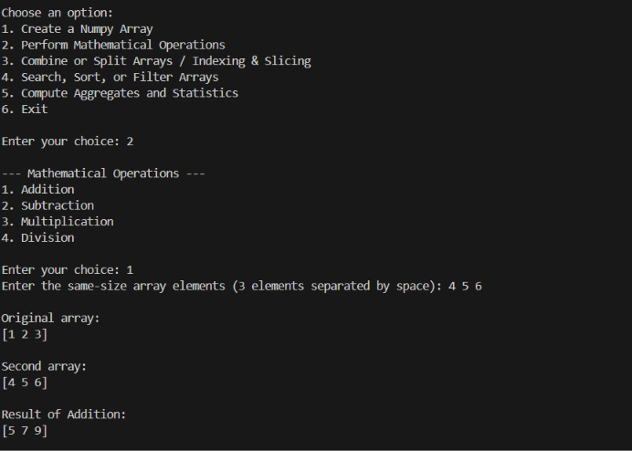
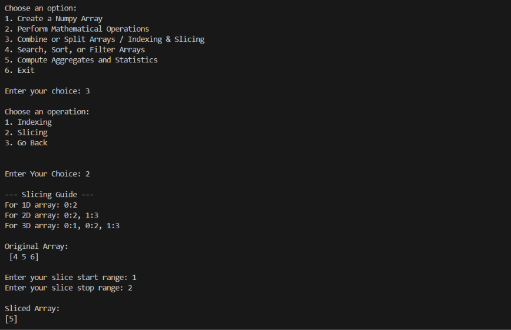
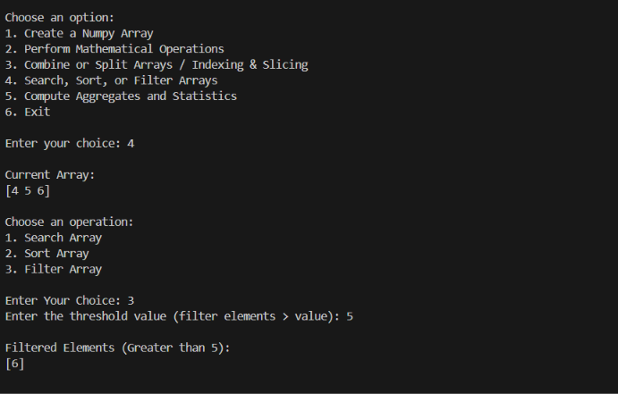
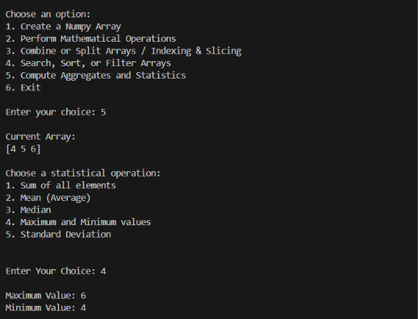
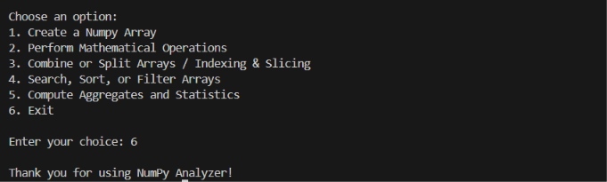

# 📊 Advanced NumPy Data Analyzer

## 📖 Project Overview
The **Advanced NumPy Data Analyzer** is a robust, interactive, console-based application designed for deep data manipulation, mathematical computation, and statistical analysis using arrays. Built entirely on advanced **Object-Oriented Programming (OOP)** paradigms, this tool bridges the gap between fundamental Python programming and high-level Data Science/Machine Learning data preprocessing workflows.

This project handles everything from creating complex multi-dimensional arrays (1D, 2D, 3D) to performing precise slicing, threshold-based filtering, and generating statistical insights—all through a clean, menu-driven user interface.

---

## 🏗️ Core OOP Architecture & Principles
The true strength of this application lies in its highly scalable architectural design. It utilizes a deep **Multi-Level Inheritance** tree and strictly adheres to standard OOP principles:

### 1. Abstraction
* Uses Python's `abc` module (`ABC`, `@abstractmethod`) to create a strict blueprint[cite: 3].
* The base class `NumpyAnalyzer` enforces that every child class must implement the `module_name()` method, ensuring consistent structural integrity across the app[cite: 3].

### 2. Encapsulation & Data Hiding
* **Private Variables:** The core array storage is strictly hidden inside the `__arrays` private instance variable, protecting it from unintended external modification[cite: 3].
* **Property Decorators:** Access to the stored arrays is securely managed using `@property` (getter) and `@array.setter` decorators, which also include built-in type checking (ensuring the input is always a list)[cite: 3].

### 3. Multi-Level Inheritance Tree
The functionality is meticulously divided into logical subclasses, where each class inherits the capabilities of its parent[cite: 3]:
`NumpyAnalyzer` ➔ `CreateArray` ➔ `MathOperation` ➔ `CombineSplitArray` ➔ `SearchSortFilter` ➔ `StatisticsAnalyzer`

### 4. Polymorphism (Method Overriding)
* Every subclass overrides the abstract `module_name()` method to return a dynamic string representing its specific operational context (e.g., `"Search, Sort and Filter Module"` vs. `"Statistics Module"`)[cite: 3].

### 5. Advanced Methodologies
* **Class Methods (`@classmethod`):** Tracks the global state of the application, such as maintaining a running count of total initialized analyzer objects (`object_count`)[cite: 3].
* **Static Methods (`@staticmethod`):** Handles utility functions that do not require access to class or instance data, such as displaying the UI menus and welcome messages[cite: 3].
* **Magic Methods / Dunder Methods:** Customizes the object's string representation using `__str__` to output a clean summary of the application name and the current number of stored arrays[cite: 3].

---

## ✨ Detailed Feature Breakdown

### 🛠️ 1. Array Generation (`CreateArray` Module)
Allows users to instantiate NumPy arrays dynamically from standard user input[cite: 3]:
* **1D Arrays:** Simple linear data sequences[cite: 3].
* **2D Arrays (Matrices):** Custom row/column inputs with strict total element validation[cite: 3].
* **3D Arrays (Tensors):** Complex depth/row/col configurations for advanced data structuring[cite: 3].

### 🧮 2. Mathematical Operations (`MathOperation` Module)
Performs element-wise arithmetic between two arrays of the exact same dimensions and size[cite: 3]:
* Includes built-in validation to check `first_array.size` and `first_array.shape` against the user's secondary input before processing[cite: 3].
* Supports operations: **Addition (`np.add`)**, **Subtraction (`np.subtract`)**, **Multiplication (`np.multiply`)**, and **Division (`np.divide`)[cite: 3]**.

### ✂️ 3. Indexing & Slicing (`CombineSplitArray` Module)
Provides granular access to specific data points within multi-dimensional arrays[cite: 3]:
* **Dynamic Indexing:** Extracts single elements whether the array is 1D (`[x]`), 2D (`[row, col]`), or 3D (`[depth, row, col]`)[cite: 3].
* **Advanced Slicing:** Extracts sub-matrices, entire rows, entire columns, or specific 3D sub-cubes using NumPy's highly optimized slice notation[cite: 3].

### 🔍 4. Search, Sort & Filter (`SearchSortFilter` Module)
Essential data wrangling tools[cite: 3]:
* **Search:** Uses `np.where()` to locate the exact indices of a specified value[cite: 3].
* **Sort:** Flattens and mathematically sorts the dataset using `np.sort()`[cite: 3].
* **Filter:** Applies boolean masking to extract elements greater than a user-defined threshold (`array[array > value]`)[cite: 3].

### 📈 5. Aggregates & Statistics (`StatisticsAnalyzer` Module)
Computes vital mathematical statistics across the dataset[cite: 3]:
* **Sum** (`np.sum`)
* **Mean/Average** (`np.mean`)
* **Median** (`np.median`)
* **Min & Max Values** (`np.min`, `np.max`)
* **Standard Deviation** (`np.std`) for variance tracking[cite: 3].

---

## 📂 File Structure

* `main.py`
  * The frontend entry point of the application[cite: 2].
  * Contains the continuous `while True` operational loop[cite: 2].
  * Manages the complete user flow, menu routing, and dynamic input handling[cite: 2].
  * Implements robust `try-except` blocks (handling `ValueError` and general `Exception`) to prevent fatal application crashes during invalid inputs[cite: 2].

* `oop.py`
  * The computational backend of the program[cite: 2, 3].
  * Houses all the base and inherited classes, NumPy logic, abstract methodologies, and encapsulation properties[cite: 3].

---

## 🛡️ Error Handling & Validation
The system is built to be crash-resistant. It actively handles:
* **Empty Array States:** Prevents operations on operations like Math or Slicing if an array hasn't been instantiated yet (via the `has_array()` method)[cite: 2, 3].
* **Dimension Mismatches:** Throws custom errors if a user attempts to reshape an array with the wrong number of total elements[cite: 3].
* **Input Validation:** Catches `ValueError` strings when integers are expected in the main execution loop[cite: 2].

---

## 🚀 Installation & Usage

### Prerequisites
* Python 3.8+
* NumPy Library

### Installation
1. Clone the repository or download the project files.
2. Install the required dependency using pip:
   ```bash
   pip install numpy

### Project Screenshots

| Option 1 | Option 2 | Option 3 |
| :---: | :---: | :---: |
|  |  |  |

| Option 4 | Option 5 | Option 6 |
| :---: | :---: | :---: |
|  |  |  |
